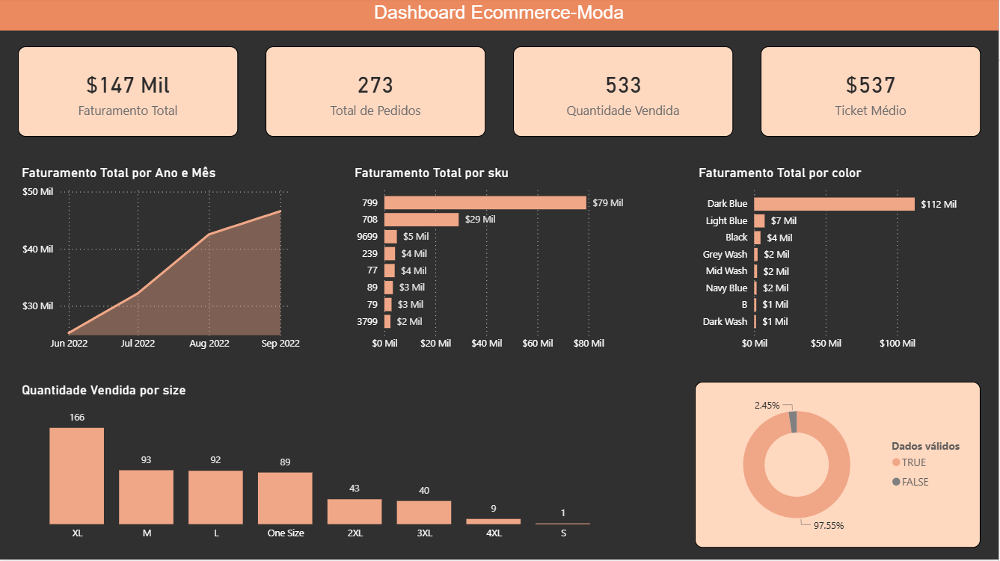

 Dashboard E-commerce Moda – Power BI

Projeto de análise de dados simulando um cenário real de e-commerce de moda, cobrindo todo o pipeline: **Python → SQL → Power BI**.

---

 Dashboard



---

 Objetivo

Analisar o desempenho de vendas de um e-commerce de moda, respondendo perguntas como:

- Como o faturamento evolui ao longo do tempo?
- Quais SKUs e cores geram mais receita?
- Quais tamanhos vendem mais?
- Qual a qualidade dos dados utilizados na análise?

---

 Principais Insights

- **Faturamento total de $147 mil** gerado entre junho e setembro de 2022
- **Dark Blue** é a cor mais vendida, representando mais de **$112 mil** em faturamento — sozinha responde por 76% da receita total
- **SKU 799** lidera o ranking de produtos com **$79 mil** em vendas
- O tamanho **XL** é o mais vendido com 166 unidades, seguido de M e L
- **97,55% dos dados são válidos** — análise de qualidade aplicada com flag TRUE/FALSE por SKU
- Faturamento apresentou **crescimento contínuo** ao longo dos 4 meses analisados

---

 Tecnologias Utilizadas

| Ferramenta | Uso |
|---|---|
| Python (Pandas) | Pré-processamento e limpeza dos dados |
| SQL | Consultas analíticas e transformações |
| Power BI | Dashboard interativo e visualizações |
| Power Query | Tratamento e validação de dados |
| DAX | Criação de KPIs e métricas |

---

 Estrutura do Projeto

```
ecommerce_moda_analise_dados/
├── analise-ecommerce-moda/
│   ├── python/        → Scripts de tratamento com Pandas
│   ├── sql/           → Queries de limpeza e análise
│   ├── powerbi/       → Arquivo .pbix do dashboard
│   └── dados/         → Base de dados em CSV
├── images/            → Prints do dashboard
└── README.md
```

---

 KPIs do Dashboard

| Métrica | Valor |
|---|---|
| Faturamento Total | $147 Mil |
| Total de Pedidos | 273 |
| Quantidade Vendida | 533 |
| Ticket Médio | $537 |
| Taxa de dados válidos | 97,55% |

---

 Autor

**João Pedro Alexandre Soares Bezerra**  
Jovem Aprendiz RH/TI · Neoenergia Pernambuco  

[](https://github.com/joaopedro4250)
[](https://www.linkedin.com/in/joao-pedro-alexandre-145b10351/)
